# Bootstrap Course

This project is meant to teach Bootstrap fundamentals by creating a bookshop, step by step. <br/>
It uses [Bootstrap 5](https://getbootstrap.com) pages, [Handlebars](https://handlebarsjs.com/guide/) templating, some [JavaScript](https://www.w3schools.com/js/) and the [Bookly](https://templatesjungle.com/downloads/bookly-bookstore-ecommerce-bootstrap-website-template/) E-Commerce theme, and it stores its data in the browser's LocalStorage. Please try the live-demo on: https://artingo.github.io/Bootstrap-BookShop/

This is how the final shop looks like:
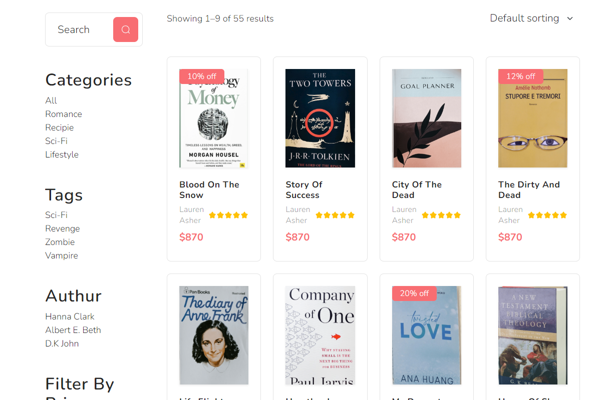<br/>
<br/>

Follow these steps to implement the bookshop:
## 1. Create project and folders
1. In your IDE, create a new Bootstrap project:<br/>
   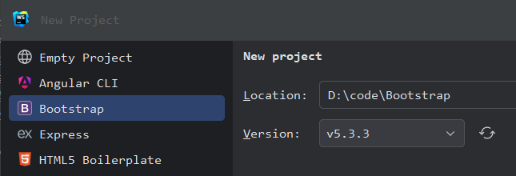
  

1. Wait until all files and folders are created. After that, add a [fonts](fonts) and [images](images) folder:<br/>
   

## 2. Add static resources
1. Search for an adequate theme, download it and copy the files into this project. For instance, I found my E-Commerce shop theme on <a href="https://templatesjungle.com/downloads/category/free-bootstrap-templates/" target="_blank">TemplatesJungle</a>.


1. Download any CDN resources, copy them to your local folders and adjust their references.
   ```html
   <link rel="stylesheet" href="css/bootstrap.min.css">
   <link rel="stylesheet" href="css/style.css">
   <link rel="stylesheet" href="css/swiper-bundle.min.css" />
   ...
   <script src="js/vendors/jquery-1.11.0.min.js"></script>
   <script src="js/vendors/bootstrap.bundle.min.js"></script>
   <script src="js/vendors/swiper-bundle.min.js"></script>
   <script src="js/vendors/script.js"></script>
   ```
2. Open the start page ([index.html](index.html)) in your browser. In a JetBrains IDE, the URL would be e.g. http://localhost:63342/BookShop/index.html


1. Check and correct all hyperlinks so that the navigation works, locally, and no network or JavaScript errors occur.

## 3. Split pages into partials
### Replace the Header
1. Download [Handlebars.js](https://handlebarsjs.com/installation/#downloading-handlebars) from the [official website](https://handlebarsjs.com/guide/) and copy it to the [vendors](js/vendors) folder.
  
 
1. Download my [vanilla.js](js/vanilla.js) file from <a href="https://raw.githubusercontent.com/artingo/Bootstrap-BookShop/master/js/vanilla.js" target="_blank">GitHub</a> and copy it to the [js](js) folder. It contains basic DOM, Events and Render functions.
  

1. In the HTML `head` section add 2 `script tags:
   ```html
   <script src="js/vendors/handlebars.min.js"></script>
   <script src="js/vanilla.js"></script>
   ```
2. Create a [partials](partials) folder for header, footer and other templates.
  

1. Inside, create an empty [header.html](partials/header.html) file.
  

1. Edit the [index.html](index.html) file, cut out it's header code and paste it into the [header.html](partials/header.html) file.
   ```html
   <svg xmlns="http://www.w3.org/2000/svg">...
   <div id="preloader" class="preloader-container">...
   <div class="search-popup">...
   <header id="header" class="site-header">...
   ```
2. Now, we want to replace the former static `header` code with the newly created Handlebars template. To do so, replace the former `header` with this  code: 
   ```html
   <div>
      <script type="text/x-handlebars-template">
      {{> partials/header index='active' }}
      </script>
   </div>
   ```
3. To active Handlebars' template rendering, add a `render` call to the HTML body: `<body onload="render()">`. This function will scan your HTML page for any Handlebars `<script>` tags and dynamically render them. It will also load any partials.
  

1. Reload the index page in your browser, open the JavaScript console by pressing the `F12` key, and correct any JS errors that may occur.
  

1. The last step is to dynamically highlight the active navigation link. To do so, add this small Handlebars code to the Overview navigation link in [header.html](partials/header.html):
    ```handlebars
    <li class="nav-item">
      <a class="nav-link me-4 {{index}}" href="index.html">Overview</a>
    </li>
    ```
    Add a corresponding Handlebar code to all navigation links in [header.html](partials/header.html).<br/>
    The corresponding part in [index.html](index.html) looks like this:
    ```handlebars
    {{> partials/header index='active' }}
    ```
2. To replace all headers with a Handlebar template, repeat steps 7 to 10 for all HTML files.

### Replace the hero section
1. Inside the [partials folder](partials), create an empty [hero.html](partials/hero.html) file.
2. Move the HTML code from the hero section to this new file.
3. At the `<h1>` tag, replace the static title with a Handlebars expression: `<h1>{{title}}</h1>`
4. In the [index.html](index.html) file, place a Handlebars script and pass the title as parameter:
   ```handlebars
   <div>
     <script type="text/x-handlebars-template">
       {{> partials/hero title='Shop' }}
     </script>
   </div>
   ```

### Replace the footer
1. Repeat steps 1 to 4 for the `<footer>` section.
   ```handlebars
   <div>
     <script type="text/x-handlebars-template">
       {{> partials/footer }}
     </script>
   </div>
   ```

### Replace the HTML head
1. Repeat steps 1 to 4 for the `<head>` section.
   ```handlebars
   <script type="text/x-handlebars-template">
     {{> partials/htmlHead }}
   </script>
   ```

### Partialize the other pages
In all other HTML files, replace the static HTML sections with dynamic Handlebars scripts. 

## 4. Populate shop with dynamic data
### Load books from an external file
To keep the store flexible, it is important to be able to load the books from outside. To do this, we need to load the book data from an external file. We use the "JSON" format, which is very common and can be exported from many data sources.
1. In the [js](js) folder, create a [data.js](js/data.js) file that contains the book data. It may look like this:
   ```javascript
   const data = {
      "books": [
        {
           "id": 1,
           "title": "20000 Leagues Under the Sea",
           "author": "Verne, Jules",
           "genre": "fiction",
           "publisher": "Wordsworth",
           "price": 19.7,
           "image": "https://m.media-amazon.com/images/I/913ii-IVEXL._AC_UY218_.jpg"
        },
        ...
      ]
   }
   ```
2. In the [index.html](index.html) file, add a `<script>` tag to load that data file.
   ```html
   <head>
     <script src="js/vendors/handlebars.min.js"></script>
     <script src="js/vanilla.js"></script>
     <script src="js/data.js"></script>
   ...
   </head>
   ```   
3. Load the index page in the browser, open a JavaScript console by pressing CTRL + SHIFT + J (Windows / Linux) or COMMAND + OPTION + J (macOS). Type this command in the console to check the proper data loading: `console.log(data)`. It should prompt the books as seen on this screenshot:<br/>
   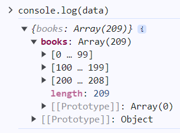

### Display books on overview page
1. Now it is time to display the books' data on the index page. Iterate over the books with `#each books`. 
2. Within the loop you can display each field by using its name, e.g. `{{title}}`. 
3. If there is no image data, you may replace it with a placeholder image, using Handlebars' `if else` helper. 
4. The resulting code may look like this:
   ```handlebars
   <div class="row row-cols-lg-5 row-cols-md-4 row-cols-sm-2 row-cols-1">
     {{#each books}}
     <div class="col mb-4">
       <div class="card border rounded-3">
         
         <h6><a href="details.html?id={{id}}">{{title}}</a></h6>
         <div>
           <p>{{author}}</p>
         </div>
         <span>${{price}}</span>
         <div>
           <button type="button" href="#" class="btn btn-dark">
             <svg class="cart"><use xlink:href="#cart"></use></svg>
           </button>
         </div>
       </div>
     </div>
     {{/each}}
   </div>
   ```   
5. The shop should now display all your books, like in the screenshot:<br/>
   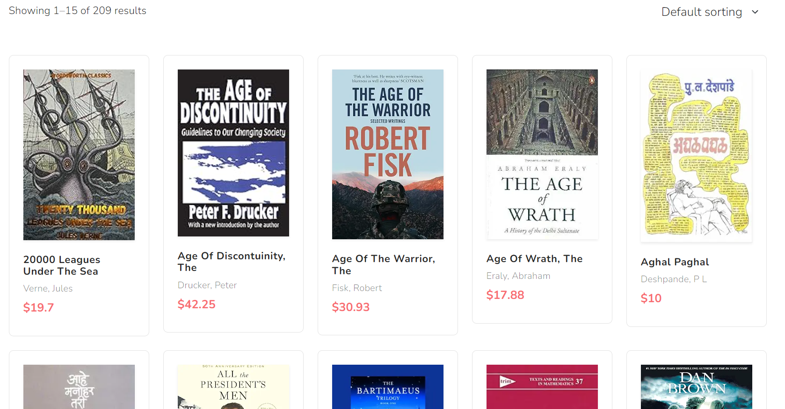

### Enable pagination
Now, we can see all 209 books from the [data](js/data.js) file but these are too many entries at once. To handle this, we introduce a `pagination`, i.e. show only 15 books at once and offer a navigation to the next / previous page. 
1. In the [js](js) folder, create an [index.js](js/index.js) JavaScript file to handle the JavaScript code for the index page. Write a function that handles the pagination of the books array: `function paginate(books)`
2. We want to control the pagination via the URL parameter "page". So we query this parameter in our function. If no parameter is present, we use `1` as our default value.
   ```javascript
   const params = new URLSearchParams(location.search)
   const currentPage = parseInt(params.get('page')) || 1
   ```
3. Next, we want to calculate the `pageCount` to know how many pagination entries we need to create.
   ```javascript
   const totalBooks = books.length
   const size = 15
   const pageCount = Math.ceil(totalBooks / size)
   ```
4. We use a `pages` array to model the pagination entries. Inside, the `page` contains the number of the current pagination page, while `active` marks the current page that needs to be highlighted.
   ```javascript
   const pages = Array.from({length: pageCount}, function (value, index) {
     const page = index + 1
     return {
       page: page,
       active: page === currentPage ? 'active' : ''
     }
   })
   ```
5. We also want to display the current book list section with `from`, `to` and `totalBooks`. 
   ```javascript
   let from = (currentPage - 1) * size
   const to = from + size
   const totalBooks = books.length
   ```
6. Next, we send this data to the `render()` function within [vanilla.js](js/vanilla.js).
   ```javascript
   render({
     books: books.slice(from, to),
   
     from: ++from,
     to: to,
     totalBooks: totalBooks,

     currentPage: currentPage,
     pages: pages,
     prevPage: Math.max(currentPage - 1, 1),
     nextPage: Math.min(currentPage + 1, pageCount)
   })
   ```
7. To show the `from`, `to` and `totalBooks` values, open the index file and scroll to the `showing-product` section. Insert this code:
   ```handlebars
   <div class="showing-product">
     <p>Showing {{from}}–{{to}} of {{totalBooks}} results</p>
   </div>
   ```
8. To show the pagination links, scroll to the `Page navigation` section and insert this code:
   ```handlebars
   <nav class="py-5" aria-label="Page navigation">
     <ul class="pagination justify-content-center gap-4">
       <li class="page-item">
         <a class="page-link" href="?page={{prevPage}}">&lt;</a>
       </li>
       {{#each pages}}
       <li class="page-item {{active}}">
         <a class="page-link" href="?page={{page}}">{{page}}</a>
       </li>
       {{/each}}
       <li class="page-item">
         <a class="page-link" href="?page={{nextPage}}">&gt;</a>
       </li>
     </ul>
   </nav>
   ```
9. The result should look like this:<br/>
   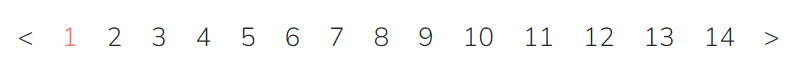
10. Test the proper pagination by clicking the links!

### Enable sorting
Next, we want to be able to sort the books by title, price, etc. On the home page, there is a dropdown list that we want to populate and activate. The best way is to keep it in the JavaScript model. Thus, we can add more sorting in the future.
1. In the [index.js](js/index.js) file, create an object to contain keys and labels of the sorting:
   ```javascript
   const SORTING = {
      DEFAULT:    "Reset Sorting",
      ALPHA_UP:   "Name A-Z",
      ALPHA_DOWN: "Name Z-A",
      PRICE_UP:   "Price (Low-High)",
      PRICE_DOWN: "Price (High-Low)"
   }
   ```
2. Implement a method to create the model of the dropdown list. We need an array of objects containing `value, selected and label`.
   ```javascript
   function createSortingModel(currentSorting) {
     const sorting = []
     for (const [key, value] of Object.entries(SORTING)) {
       const entry = {
         value: key,
         selected: (key === currentSorting) ? "selected" : "",
         label: value,
       }
       sorting.push(entry)
     }
     return sorting
   }
   ```
3. Now, we can populate the `<option>` array of the sorting dropdown in the [index.html](index.html) file.
   ```handlebars
   <select id="sorting" class="form-select" onchange="triggerSorting(this)">
     {{#sorting}}
       <option value="{{value}}" {{selected}}>{{label}}</option>
     {{/sorting}}
   </select>
   ```
   It should look like this, now:<br/>
   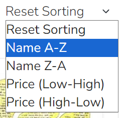

4. Next, we want to implement the JavaScript function that triggers the sorting, once we change the selection in the dropdown list. For that, we pass the dropdown reference and append its value to the URL.
   ```javascript
   function triggerSorting(element) {
     const searchParams = new URLSearchParams(location.search)
     searchParams.set('sort', element.value)
     searchParams.set('page', "1")
     location.search = searchParams.toString()
   }
   ```
5. The last step is to actually sort the books array. In JavaScript, you can sort an array by passing a sorting function with parameters `a and b`. Inside, you compare these neighboring array elements and return `1`, `0` or `-1`. This moves the second element up, same place or down in  the list.
   ```javascript
   function handleSorting(books, currentSorting) {
     switch (currentSorting) {
       case "DEFAULT":
       case "ALPHA_UP":
         books.sort(function(a, b) {
           return a.title < b.title ? -1 : a.title > b.title ? 1 : 0
         })
         break
       case "ALPHA_DOWN":
         books.sort(function(a, b) {
           return a.title < b.title ? 1 : a.title > b.title ? -1 : 0
         })
         break
       case "PRICE_UP":
         books.sort(function(a, b) { return a.price - b.price })
         break
       case "PRICE_DOWN":
         books.sort(function(a, b) { return b.price - a.price })
      }
      return books
   }
   ```
6. Test the sorting in the browser. For instance, if you sort by price (descending), the result should look like this:<br/>
   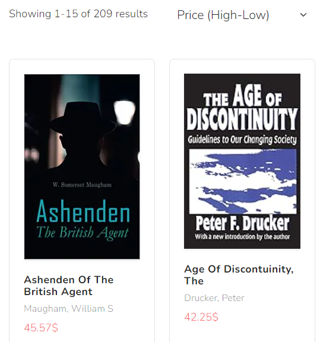

### Enable genres
When you have a lot of books, it makes sense to filter them by 'genres'. It works in a similar way to sorting:
* create the model for the HTML links
* react to search parameters
* handle the current genre in the books model

1. In the [index.js](js/index.js) file, create an object to contain keys and titles of the genres:
   ```javascript
   const GENRES = {
     comic: "Comics",
     computer_science: "Computer Science",
     ...
     signal_processing: "Signal Processing"
   }
   ```
   
2. Implement a method to create the model of the genres list. We need an array of objects containing `value, active and title`.
   ```javascript
   function createGenreModel(currentGenre) {
      const genres = []
      for (const [key, value] of Object.entries(GENRES)) {
        const entry = {
          value: key,
          active: key === currentGenre? 'active' : '',
          title: value,
        }
      genres.push(entry)
      }
      return genres
   }
   ```
   
3. Now, we can populate the genres in the [genres.html](partials/genres.html) file.
   ```handlebars
   <ul class="product-categories mb-0 sidebar-list list-unstyled">
     {{#genres}}
     <li class="cat-item {{active}}">
       <a href="?genre={{value}}" title="{{title}}">{{title}}</a>
     </li>
     {{/genres}}
   </ul>
   ```
   It should look like this, now:<br/>
   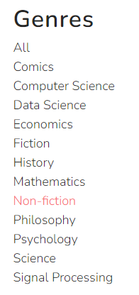

4. If you want, you can also generate the genres in the search pop-up, dynamically. To do so, insert this code in the `search-popup` section of [header.html](partials/header.html):
   ```handlebars
   <h5 class="cat-list-title">Browse Categories</h5>
   <ul class="cat-list">
      {{#genres}}
      <li class="cat-list-item {{active}}">
          <a href="?genre={{value}}" title="{{title}}">{{title}}</a>
      </li>
      {{/genres}}
   </ul>
   ```
   The result should look like this:<br/>
   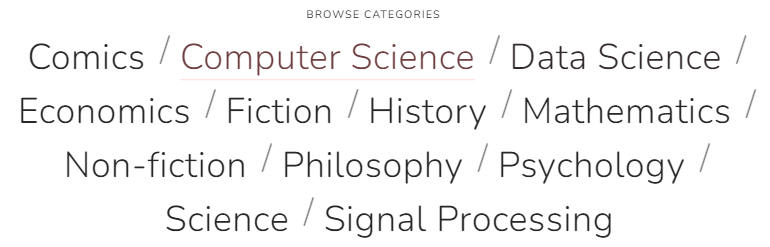

5. As the current genre is now passed as a search parameter, we can react to it.
   ```javascript
   function paginate(books) {
     ...
     const currentGenre = params.get('genre')
     const filteredBooks = handleGenres(books)
     const totalBooks = filteredBooks.length
     ...
     render({
       genres: createGenreModel(currentGenre)
       ...
     })
   }
   ```
6. The last step is to actually filter the books array. In JavaScript, you can filter an array by passing a function that decides whether an entry should be returned or not. 
   ```javascript
   function handleGenres(books, currentGenre) {
     if (currentGenre) {
       const filteredBooks = books.filter(function(book) {
         return book.genre === currentGenre
       })
       return filteredBooks
     } 
     // if genre is empty, return all books
     return books
   }
   ```
   
7. Test the genre filtering in the browser. For instance, if you click on `history`, the result should look like this:<br/>
   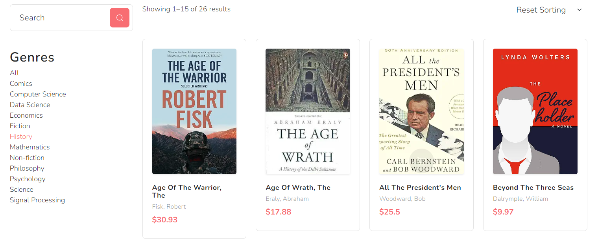
   
### Enable search functionality
Finally, we want to be able to search for books by title and author.
1. We want to trigger the search from the big search field above the genres.<br/>
   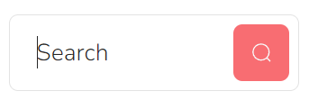
   ```html
   <form name="aside-search" onsubmit="return triggerSearch(this.search.value)">
      <input type="search" name="search">
      <button type="submit">
        <svg><use xlink:href="#search"></use></svg>
      </button>
   </form>
   ```
   
2. Let's implement that JavaScript function that adds the `searchTerm` to the URL parameters.
   ```javascript
   function triggerSearch(searchTerm) {
      if (searchTerm) {
         const searchParams = new URLSearchParams(location.search)
         searchParams.set('search', searchTerm)
         location.search = searchParams.toString()
      }
      return false
   }
   ```
   
3. In `paginate()` we pass the `searchTerm` to the `handleGenres()` function.
   ```javascript
   function paginate(books) {
     ...
     const searchTerm = params.get('search')
     const filteredBooks = handleGenres(books, currentGenre, searchTerm)
     ...
     render({
       search: searchTerm,
       ...
     }
   }
   ```
   
4. In `handleGenres()`, after filtering the genre, we additionally filter the books by the `searchTerm`. For the comparison itself, we use `includes()` because it also finds partial String matches. And to receive more results, we transform title and author to lower case.
   ```javascript
   function handleGenres(books, currentGenre, searchTerm) {
     ...
     if (searchTerm) {
       const searchTermLower = searchTerm.toLowerCase()
       filteredBooks = filteredBooks.filter(function(book) {
         return book.title.toLowerCase().includes(searchTermLower)
           || book.author.toLowerCase().includes(searchTermLower)
       })
     }
   }
   ```
   
5. To re-use the `searchTerm`, we pass it to Handlebars, so it gets displayed in the search field after page reload.
   ```handlebars
   <input type="search" name="search" value="{{search}}">
   ```
   
6. You may want to add the search functionality to the search pop-up in [header.html](), as well. 
   ```handlebars
   <form name="header-search" onsubmit="return triggerSearch(this.search.value)">
      <input type="search" name="search">
      <button type="submit">
        <svg><use xlink:href="#search"></use></svg>
      </button>
   </form>
   ```
   
7. To maintain all the URL parameters, you should refactor your [pagination.html](partials/pagination.html) to contain the additional parameters.
   ```handlebars
   <li class="page-item {{active}}">
     <a class="page-link" href="?search={{@root.search}}&genre={{@root.genre}}&sort={{sort}}&page={{page}}">{{page}}</a>
   </li>
   ```
   
8. Test the combined search, genre, sorting and pagination in your browser.<br/>
   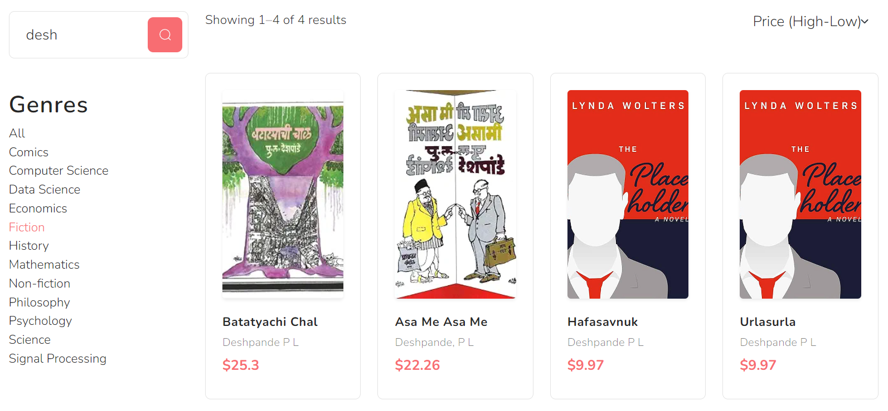

## 5. Enable cart functionality
Now that we can browse through the product range, it's time to fill the shopping cart. To do this, we first implement the addition of an article to the shopping cart.

As the mini shopping cart will appear in the header of every page, we outsource its JavaScript code to a separate [shop.js](js/shop.js) file. First of all, we need an internal data model to map the shopping cart.:
   ```javascript
   let cart = {
      items: [],
      numOfItems: 0,
      grandTotal: 0
   }
   ```

We also save its status in `SessionStorage` so that we can access it from any page:
   ```javascript
   function initCart(querySelector) {
      const cartInSession = sessionStorage.getItem("cart")
      if (cartInSession) {
         cart = JSON.parse(cartInSession)
      }
      render(cart, querySelector)
   }
   ```
To update the mini shopping cart in the header, on every page, as soon as the DOM is loaded, it is loaded from the SessionStorage and rendered .
   ```javascript
   document.addEventListener("DOMContentLoaded", function (event) {
     setTimeout(function () {
       if (cart.numOfItems === 0) {
         initCart()
       }
       // wait 150 milliseconds, so that other Handlebars DOM elements may be created, first!
     }, 150)
   })
   ```

### Add items to cart
1. First, we add a JavaScript click handler to the shopping cart icon.
   ```html
   <button type="button" onclick="addToCart({{id}})">
     <svg class="cart"><use xlink:href="#cart"></use></svg>
   </button>

   ```
2. In `addCart()`, we first check if this is a valid article. Next, we check if this item already exists in the shopping cart. If not, we create a `cartItem` with `quantity` and `total` fields. After that, we add the new `cartItem` to the array of `cart.items`. Last, we increase the `quantity` and refresh the header.
   ```javascript
   function addToCart(articleNo) {
     // is this a valid shop article?
     const shopItem = findItemInArticles(articleNo)
     if (shopItem) {
       // is article already in cart?
       let cartItem = findItemInCart(articleNo)
       if (!cartItem) {
         cartItem = shopItem
         cartItem.quantity = 0
         cartItem.total = 0.0
         cart.items.push(cartItem)
       }
       increaseQuantity(cartItem)
       refresh('#partial-header')
     } else {
       console.warn(`Article with id '${articleNo}' doesn't exist`)
     }
   }
   ```

### Increase item number
In `increaseQuantity()`, we set a couple of field to display in the mini cart, as well as the cart page.
```javascript
function increaseQuantity(item, doRefresh) {
   item.quantity++
   item.showQuantity = (item.quantity > 1)
   item.total += item.price
   cart.numOfItems++
   cart.grandTotal += item.price
}
```

### Store cart items in SessionStorage
To persists the current cart items temporarily, we store them in the SessionStorage: 
```javascript
sessionStorage.setItem("cart", JSON.stringify(cart))
```

### Show cart items in header
1. To show the mini cart in the header, we re-render the `#partial-header` and pass the cart data as argument.
   ```javascript
   render(cart, '#partial-header')
   ```
2. In [header.html](partials/header.html), we iterate over the cart items and display their details.
   ```handlebars
   <ul class="list-group mb-3">
     {{#items}}
     <li class="...">
       <h5><a href="details.html?id={{id}}">
         {{#if showQuantity}} {{quantity}} × {{/if}}
         {{title}}</a>
       </h5>
       <small>{{author}}</small>
       <span class="text-primary">${{toFixed total}}</span>
     </li>
     {{/items}}
     ...
   </ul>
   ```

### Show cart items in cart page
In [cart.html](cart.html), we display the cart items as a table. We add buttons to increase / decrease their quantity, and a delete icon.  
```handlebars
{{#items}}
<div class="cart-item border-bottom">
  <div class="row align-items-center">

    <div class="col-lg-4 col-md-3">
      
      <h5><a href="details.html?id={{id}}">{{title}}</a></h5>
      <span>${{toFixed price}}</span>
    </div>

    <div class="col-lg-6 col-md-7">
      ...
      <input type="text" name="quantity" value="{{quantity}}">
      ...
      <span>${{toFixed total}}</span>
    </div>

    <div class="col-lg-1 col-md-2">
      ...
      <svg><use xlink:href="#cart-cross-outline"></use></svg>
    </div>
  </div>
</div>
{{/items}}
```

### Increase and decrease quantity
1. To increase and decrease the quantity of a cart item, we use buttons that trigger the corresponding JavaScript functions.
   ```html
   <button type="button" onclick="decreaseQuantity({{id}})">
     <svg><use xlink:href="#minus"></use></svg>
   </button>
   ...
   <button type="button" onclick="increaseQuantity({{id}}, true)">
      <svg><use xlink:href="#plus"></use></svg>
   </button>
   ```
2. Inside `decreaseQuantity()`, we modify the cart model and refresh the Handlebars templates on the page.
   ```javascript
   function decreaseQuantity(item) {
     if (item.quantity > 0) {
       item.quantity--
       item.total -= item.price
       cart.numOfItems--
       cart.grandTotal -= item.price

       refresh('#partial-header')
       refresh('#cart-table')
     }
   }
   
   function refresh(querySelector) {
     sessionStorage.setItem("cart", JSON.stringify(cart))
     render(cart, querySelector)
   }
   ```

### Remove cart item dialog
1. As the cart item removal is an irrevocable operation, we display a confirm dialog, before. We also memorize the id of the `itemToRemove`, so we can refer to it, later.
   ```html
   <a href="#" data-bs-toggle="modal" data-bs-target="#confirm-delete"
     onclick="itemToRemove={{id}}">
     <svg class="cart-cross-outline" width="38" height="38">
       <use xlink:href="#cart-cross-outline"></use>
     </svg>
   </a>
   ```
2. The confirm dialog uses standard BootsTrap mechanisms to display and dismiss it.
   ```html
   <div class="modal fade" id="confirm-delete" tabindex="-1">
     <div class="modal-dialog modal-sm">
       <div class="modal-content">
         <div class="modal-header">
           <h1 class="modal-title fs-5">Confirm removal</h1>
           <button type="button" class="btn-close" data-bs-dismiss="modal" aria-label="Close"></button>
         </div>
         <div class="modal-body">
           Do you really want to remove this cart item?
         </div>
         <div class="modal-footer">
           <button type="button" class="btn btn-dark" data-bs-dismiss="modal">Cancel</button>
           <button type="button" class="btn btn-danger" data-bs-dismiss="modal"
             onclick="removeFromCart(itemToRemove)">Yes, remove!</button>
         </div>
       </div>
     </div>
   </div>
   ```
3. Finally, we recalculate the cart model, remove the current item from the `cart.items` and display the changes on the page by calling `refresh()`.
   ```javascript
   function removeFromCart(articleNo) {
     const cartItem = findItemInCart(articleNo)
     if (cartItem) {
       cart.numOfItems -= cartItem.quantity
       cart.grandTotal -= cartItem.total
       const itemIndex = cart.items.indexOf(cartItem)
       cart.items.splice(itemIndex, 1)
   
       refresh('#partial-header')
       refresh('#cart-table')
     }
   }
   ```
