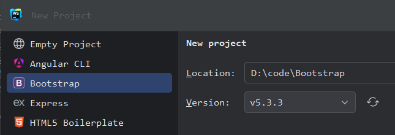
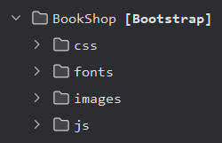

# Bootstrap Course

This project is meant to teach Bootstrap fundamentals by creating a book shop, step by step. <br/>
It uses [Bootstrap 5](https://getbootstrap.com) pages, [Handlebars](https://handlebarsjs.com/guide/) templating, some [JavaScript](https://www.w3schools.com/js/) and the [Bookly](https://templatesjungle.com/downloads/bookly-bookstore-ecommerce-bootstrap-website-template/) E-Commerce theme, and it stores it's data in the browser's LocalStorage.

This is how the final shop looks like:

<br/>
<br/>

Follow these steps to implement the book shop:
## 1. Create project and folders
1. In your IDE, create a new Bootstrap project:<br/>
   
  

2. Wait until all files and folders are created. After that, add a [fonts](fonts) and [images](images) folder:<br/>
   

## 2. Add static resources
1. Search for an adequate theme, download it and copy the files into this project. For instance, I found my E-Commerce shop theme on <a href="https://templatesjungle.com/downloads/category/free-bootstrap-templates/" target="_blank">TemplatesJungle</a>.
2. Download any CDN resources, copy them to your local folders and adjust their references.
   ```html
   <link rel="stylesheet" href="css/bootstrap.min.css">
   <link rel="stylesheet" href="css/style.css">
   <link rel="stylesheet" href="css/swiper-bundle.min.css" />
   ...
   <script src="js/vendors/jquery-1.11.0.min.js"></script>
   <script src="js/vendors/bootstrap.bundle.min.js"></script>
   <script src="js/vendors/swiper-bundle.min.js"></script>
   <script src="js/vendors/script.js"></script>
   ```
3. Open the start page ([index.html](index.html)) in your browser. In a JetBrains IDE, the URL would be e.g. http://localhost:63342/BookShop/index.html
4. Check and correct all hyperlinks so that the navigation works, locally, and no network or JavaScript errors occur.
